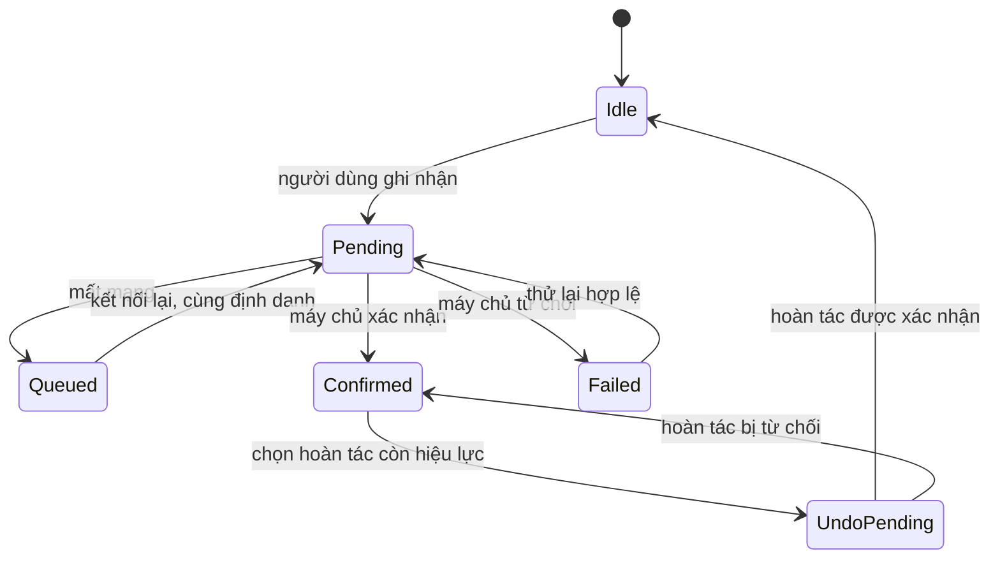

# Animation và phản hồi tương tác

Tài liệu bàn giao cho thiết kế trong [hoiMau.pen](../../design/hoiMau.pen). Animation giúp hiểu điều vừa xảy ra và giữ ngữ cảnh; không dùng để che thời gian chờ hoặc biến ghi nhận thói quen thành một trò chơi gây áp lực.

Các giá trị dưới đây là thông số thiết kế đề xuất. GIF đã được tạo và kiểm tra metadata; animation native chưa được tích hợp vào React Native.

## Tài sản bàn giao

Bản xem trực tiếp: [playground](../../design/motion/playground.html). Mọi chuyển động trong danh mục bên dưới, dữ liệu từ [catalog.json](../../design/motion/catalog.json); mở thẳng bằng trình duyệt, không tự chạy, có công tắc “Giảm chuyển động”. GIF bên dưới giữ lại làm tư liệu cũ.

| Minh họa | GIF | Bản giảm chuyển động | Vòng lặp xem trước |
|---|---|---|---|
| Mầm đồng hành | [mam-idle.gif](../../design/motion/mam-idle.gif) | [Ảnh tĩnh](../../design/motion/mam-idle-static.png) | 3.000 ms |
| Ghi nhận nước | [water-check-in.gif](../../design/motion/water-check-in.gif) | [Ảnh tĩnh](../../design/motion/water-check-in-static.png) | 2.000 ms |
| Hoàn thành nhiệm vụ | [quest-complete.gif](../../design/motion/quest-complete.gif) | [Ảnh tĩnh](../../design/motion/quest-complete-static.png) | 2.400 ms |

GIF dùng khung vuông để review chuyển động, không mô phỏng cả màn điện thoại. Vòng lặp có khoảng giữ để dễ xem; không lấy toàn bộ thời gian GIF làm thời gian khóa giao diện. [Manifest](../../design/motion/manifest.json) ghi kích thước, số frame, thời lượng và dung lượng thực tế. SVG gốc của Mầm: [mam.svg](../../design/assets/mam.svg).

Mở [trang xem trước](../../design/index.html) để xem ảnh tĩnh trước, chủ động mở GIF khi muốn. GIF không đọc được tùy chọn Reduce Motion; không nhúng GIF tự chạy vào màn ứng dụng thật.

## Token chuyển động

Nguồn chuẩn: [tokens.json](../../design/motion/tokens.json).

| Vai trò | Thời lượng | Cách dùng |
|---|---|---|
| `press` | 120 ms | Phản hồi nhấn; scale 1 → 0,98 nếu control không có hiệu ứng native |
| `feedback` | 220 ms | Tick, đổi nhãn, cập nhật trạng thái, chấm chưa đọc |
| `transition` | 320 ms | Phần tử xuất hiện hoặc đổi chỗ, dịch tối đa 8 dp |
| `celebration` | 450 ms | Pop thành công, huy hiệu, Mầm vui; scale 0,96 → 1 (đỉnh 1,06) |
| `countUp` | 600 ms | Đếm số XP, xu, kcal; chip “+10 XP” bay lên |
| `shimmerLoop` | 1.200 ms | Skeleton lấp lánh, lặp |
| `celebrationLong` | 1.600 ms | Lên cấp, cột mốc chuỗi, Mầm tiến hóa, kết thúc buổi tập |
| `flameLoop` | 2.000 ms | Lửa chuỗi ≥ 3 ngày, lặp khi đang được nhìn thấy |
| `demoLoop` | 2.400 ms | Minh họa động tác trong Focus Mode, lặp |
| `mascotIdle` | 3.000 ms | Mầm thở, lá đung đưa, chớp mắt, lặp |
| `repCycle` | 3.200 ms | Một lần lặp của động tác mẫu có nhịp (squat, chống đẩy tựa bàn, chùng chân lùi), lặp |
| `holdCycle` | 4.000 ms | Động tác mẫu giữ tư thế (plank tựa gối, thả lỏng vai), lặp |
| `mascotTired` | 5.000 ms | Mầm buồn ngủ, lặp |
| `undoWindow` | 5.000 ms | Thanh đếm ngược Hoàn tác; phải bằng cửa sổ nghiệp vụ F-06 do máy chủ quy định |
| `breathCycle` | 8.000 ms | Hít vào 4 giây · thở ra 4 giây |

Easing: `enter` cubic-bezier(0.2, 0, 0, 1), `exit` (0.4, 0, 1, 1), `idle` (0.4, 0, 0.6, 1), `linear`. Lò xo cho Reanimated `withSpring`: `pop` (damping 12, stiffness 220) và `gentle` (damping 18, stiffness 120); playground dùng cubic-bezier xấp xỉ `webApprox`. Chuyển màn, sheet và Back vẫn dùng motion native của nền tảng.

## Đặc tả theo tình huống

| Tình huống / màn | Kích hoạt và hành vi | Kết thúc / gián đoạn | Khi giảm chuyển động |
|---|---|---|---|
| Nút và lựa chọn | Press phản hồi ngay; radio/chip thêm dấu chọn và nhãn | Nhả tay trả lại; hủy gesture không gửi request | Giữ màu và trạng thái native, không scale |
| Onboarding S05–S08 | Giữ dữ liệu khi chuyển bước; tiêu điểm chuyển tới tiêu đề bước mới | Back giữ dữ liệu; lỗi cuộn tới trường đầu tiên | Đổi nội dung tức thời; vẫn thông báo tiêu đề |
| Mầm ở S01/S09/S22 | Nhịp idle nhỏ, không nhảy quanh CTA | Dừng khi app vào nền, màn mất focus hoặc bật Reduce Motion | SVG tĩnh, giữ nguyên tâm trạng bằng lời |
| Ghi nhận nước S09/S11 | Cập nhật phần nước lạc quan; nhãn đang gửi cho tới xác nhận | Server xác nhận mới chuyển sang đã lưu; không phát lại khi retry | Dấu chọn và chữ thay đổi trực tiếp |
| Hoàn tác S11 | Hiện snackbar cùng hành động Hoàn tác, theo cửa sổ nghiệp vụ | Hủy phần thưởng tương ứng khi server chấp nhận; lỗi nêu rõ kết quả | Không thu nhỏ/đảo ngược hiệu ứng; thông báo bằng chữ |
| XP/cấp S20/S46 | Hiện giá trị do server trả; celebration chạy một lần cho sự kiện mới | Không chờ animation mới cho thao tác tiếp; không thưởng lại lúc mở màn | Giá trị cuối và lời chúc mừng tĩnh |
| Linh vật tiến hóa S22 | Chuyển diện mạo sau kết quả đã lưu; giữ tên giai đoạn rõ | Không lùi giai đoạn khi tâm trạng giảm; background dừng animation | Thay ảnh và tên giai đoạn trực tiếp |
| Lên cấp S65 | `level-up` phát một lần sau khi server xác nhận vượt ngưỡng XP; Mầm vui cùng `mam-cheer` | “Xem tiện ích” hoặc “Để sau” đóng ngay, không chờ hết hiệu ứng; mở lại không phát lại | Thẻ cấp mới và lời chúc hiện tĩnh |
| Cột mốc S66 | `streak-milestone` trao huy hiệu 7/30/100 ngày, mỗi mốc một lần; Mầm vui cùng `mam-cheer` | Đóng được ngay; mốc đã nhận không phát lại | Huy hiệu và kỷ lục hiện tĩnh |
| Tiến hóa S69 | `mam-evolve` chuyển Mầm sang giai đoạn mới sau khi server xác nhận growth đạt 100 | Không lùi giai đoạn khi tâm trạng giảm; vào nền thì dừng ở trạng thái cuối | Mầm giai đoạn mới và tên giai đoạn hiện ngay |
| Thực đơn S13/S15 | Nhấn đổi món giữ món cũ khi đang chờ; thay nội dung sau thành công | Không đủ lượt/lỗi giữ món cũ, giải thích cạnh thao tác | Đổi ảnh/nội dung tức thời |
| Bắt đầu tập S18/S19 | Chuyển sang Focus Mode native; đồng hồ bắt đầu theo trạng thái phiên | Bấm lặp không tạo phiên mới | Không zoom ảnh; nội dung và đồng hồ vẫn hoạt động |
| Pause/resume S19/S41 | Đồng hồ thể hiện trạng thái phiên; nhãn Đang tập/Tạm dừng rõ | Thời gian tập không tính bằng số frame hay số lần timer callback | Đồng hồ vẫn cập nhật bình thường |
| Focus Mode S19/S63 | `focus-ring` cập nhật vòng tiến độ theo thời gian phiên; `focus-pause` đổi nhãn và dừng đồng hồ khi tạm dừng | Hộp thoại S63 không xóa thời gian đã tập; “Tập tiếp” trở lại đúng trạng thái phiên | Vòng nhảy theo từng giây; nhãn “Tạm dừng” hiện ngay |
| Kết thúc tập S20 | Chỉ phát celebration khi ghi nhận đã được xác nhận | Tập dở phải có lời khác hoàn thành; mạng lỗi giữ pending | Icon và lời xác nhận tĩnh |
| Tổ đội S27/S28 | Cập nhật dữ liệu ổn định; không đẩy hàng đang được chạm sang vị trí khác | Cho biết thời điểm cập nhật; phần thưởng theo server | Bố cục cập nhật không bay/nhảy hàng |
| Gửi nhắc S29 | Nút chuyển đang gửi; thành công xác nhận bằng chữ | Bị giới hạn trả lý do; không phát confetti | Chữ và icon tĩnh |
| Nhật ký S32/S33 | Giữ bản nháp trong lúc lưu; phản hồi nhẹ sau lưu | Không tạo hiệu ứng suy đoán tâm trạng từ nội dung; lỗi không làm mất chữ | Nội dung phản hồi hiện trực tiếp |
| Vé S34 | Xem trước ngày và kết quả; xác nhận rồi chờ server | Không animate giữ chuỗi trước thành công; retry không tiêu thêm vé | Kết quả trước/sau trình bày bằng chữ |
| Mua đồ S40 | Hiện giá/số dư, xác nhận, trạng thái đang xử lý | Thành công mới đổi số dư/kho đồ; không đủ xu không hiệu ứng thành công | Chữ và số dư cuối cập nhật trực tiếp |
| Offline S38 | Badge đang chờ có chữ; chuyển sang đã đồng bộ sau xác nhận | Không chạy spinner vô hạn cho dữ liệu đang chờ mạng | Icon tĩnh và trạng thái bằng chữ |
| Loading/error S39 | Skeleton cho lần tải đầu, giữ dữ liệu cũ khi refresh | Lỗi thay skeleton bằng cách thử lại, không để chờ vô hạn | Skeleton tĩnh, không shimmer |
| Quyền/riêng tư S36/S44 | Dùng prompt/sheet hệ thống; chú ý tiêu điểm và nội dung hậu quả | Cancel không đổi quyền hay xóa; chỉ hiển thị thành công sau xác nhận | Motion do hệ điều hành quản lý |

## Trạng thái ghi nhận là nguồn điều khiển

Animation chỉ quan sát trạng thái; không tạo tác dụng nghiệp vụ ở callback kết thúc animation. Không suy ra “đã lưu” từ việc một thanh chạy đầy. Các nhánh retry, request đồng thời và ngày logic theo quyết định D-04/D-05 của tài liệu phạm vi.

## Accessibility và lifecycle

- Không dùng âm thanh, rung, màu hoặc chuyển động làm thông báo duy nhất. Nội dung thành công/lỗi phải đọc được bằng trình đọc màn hình.
- Khi giảm chuyển động: bỏ translation, scale, particles và idle loop; không bỏ thông tin, affordance, hẹn giờ hoặc hành động Hoàn tác.
- Snackbar Hoàn tác phải có nhãn truy cập và được thông báo; không tự kéo dài cửa sổ nghiệp vụ chỉ vì animation chậm. Thời hạn và hành vi lỗi cần khớp server.
- Pause animation trang trí khi màn mất focus hoặc app vào nền; resume không replay thưởng. Khi unmount, hủy timer/listener/animation đang chạy.
- Không tự phát âm thanh. Haptic là tùy chọn triển khai và phải tôn trọng cài đặt hệ thống; thiết kế chưa tích hợp haptic.
- Focus Mode không dùng animation clock để đo tập. Dùng thời gian phiên đã chốt, xử lý pause/background rõ ràng và kiểm thử trên thiết bị.

## Hướng triển khai React Native

Runtime đề xuất: react-native-reanimated cho mọi chuyển động giao diện và react-native-svg cho Mầm. Mỗi mục trong catalog có `tracks` (keyframes, thời lượng, easing, độ trễ) chuyển thẳng sang Reanimated; điểm xoay của Mầm nằm sẵn trong SVG (`style="transform-origin:Xpx Ypx"`, đơn vị viewBox 128). Không dùng Lottie, Rive hay GIF trong app. Hook giảm chuyển động dùng chung: khi bật, hiển thị trạng thái tĩnh mô tả ở cột “Khi giảm chuyển động”.

Opacity/transform phù hợp cho animation đơn giản; không animate toàn bộ layout danh sách trong mỗi frame. Mục tiêu độ mượt cần đo trên thiết bị thật, không suy ra từ GIF hoặc máy phát triển. Không xuất toàn bộ màn hình thành ảnh rồi animate ảnh đó trong sản phẩm.

Động tác mẫu dùng khung xương `design/assets/exercise/rig-side.svg` và keyframe trong catalog (loại `exercise`). App có thể render trực tiếp bằng react-native-svg, hoặc phát `videoUrl` (WebM/MP4 lặp, không tiếng). Video quay thật có thể thay bất kỳ lúc nào. WebM trong repo là bản xem trước; iOS (AVPlayer) không phát WebM, nên khi đóng gói cần xuất thêm bản MP4 H.264 cho mỗi động tác.

## Kiểm chứng và giới hạn

Đã kiểm tra GIF bằng decoder: số frame, chiều rộng, chiều cao mỗi frame, tổng delay và dung lượng; có PNG tĩnh cho từng GIF. Đã xem hình poster và các frame đại diện trong quá trình bàn giao. Review thiết kế chỉ xác nhận hình ảnh tĩnh, không chứng nhận hiệu năng hoặc accessibility của app chạy.

Trước phát hành cần kiểm tra: Reduce Motion bật/tắt trong khi đang chạy, rời/quay lại app, tap nhanh, request thất bại, retry, completion lặp, phóng chữ, TalkBack/VoiceOver, pin yếu và thiết bị cấu hình thấp. Những kiểm tra native này chưa thực hiện vì ứng dụng chưa triển khai các màn.

## Danh mục chuyển động

Bảng dưới được sinh từ `design/motion/catalog.json` bằng `node design/check.mjs --sync`; không sửa tay. Mức 1 là cốt lõi, mức 2 là điểm nhấn có thể bỏ mà không ảnh hưởng thông tin. Loại `reward` và `celebration` chỉ chạy khi máy chủ đã xác nhận (`confirmed:*`).

<!-- motion-catalog:start -->
| Mã | Mức | Loại | Màn | Kích hoạt | Khi giảm chuyển động |
|---|---|---|---|---|---|
| `press-scale` | 1 | micro | * | tap:press-in | Không co giãn; chỉ đổi màu nhấn theo control của nền tảng. |
| `check-draw` | 1 | micro | * | tap:select | Dấu chọn hiện ngay cùng nhãn trạng thái. |
| `switch-slide` | 1 | micro | * | tap:toggle | Nút gạt đổi vị trí ngay; nhãn “Đang bật / Đang tắt” cập nhật. |
| `tab-pill` | 1 | micro | S09, S12, S25, S27, S31 | tap:tab | Mục vừa chọn đổi nền ngay, không trượt. |
| `chip-select` | 2 | micro | * | tap:chip | Chip đổi màu và thêm dấu chọn ngay. |
| `list-stagger` | 2 | transition | S10, S13, S21, S27, S30, S49, S51 | enter:first-load | Tất cả hàng hiện cùng lúc, không dịch chuyển. |
| `number-roll` | 1 | feedback | S08, S09, S20, S23, S46 | state:value-changed | Hiện ngay giá trị cuối cùng. |
| `progress-fill` | 1 | feedback | S09, S13, S22, S27, S46 | state:value-changed | Thanh vẽ ngay ở độ dài cuối; con số luôn hiện cạnh thanh. |
| `skeleton-shimmer` | 1 | ambient | S39 | state:loading | Khối xám đứng yên, không lấp lánh. |
| `snackbar-undo` | 1 | feedback | S09 | confirmed:progress-saved | Thanh thông báo hiện ngay; thời gian hoàn tác còn lại ghi bằng chữ. |
| `field-error` | 1 | feedback | * | state:invalid | Viền đỏ và lời nhắn hiện ngay; không rung. |
| `pending-pulse` | 1 | ambient | S09, S38 | state:queued | Chấm tĩnh kèm chữ “Đang chờ gửi”. |
| `water-check-in` | 1 | feedback | S09 | state:pending | Ô nước đổi sang đã chọn ngay; nhãn “4 / 8 phần · đang lưu”. |
| `quest-complete` | 1 | reward | S10, S20 | confirmed:quest-completed | Dấu hoàn thành và “+50 XP” hiện tĩnh. |
| `mam-idle` | 1 | mascot | S01, S09, S22 | visible:screen-focused | Mầm đứng yên; tâm trạng được nói bằng chữ bên cạnh. |
| `mam-happy` | 1 | mascot | S09, S22 | confirmed:progress-saved | Mầm đổi sang mặt vui ngay, kèm lời “Mầm vui vì bạn vừa ghi nhận”. |
| `mam-cheer` | 1 | celebration | S20, S65 | confirmed:story-complete | Mầm mặt vui đứng yên cùng lời chúc mừng. |
| `mam-tired` | 1 | mascot | S09, S22, S27, S70 | state:mood-tired | Mầm mặt buồn ngủ đứng yên; chữ “Mầm hơi buồn ngủ, đang chờ bạn quay lại”. |
| `mam-wave` | 2 | mascot | S01, S02 | enter:first-visit | Mầm giơ tay chào ở tư thế tĩnh. |
| `mam-sleep` | 2 | mascot | S45 | confirmed:bedtime-marked | Mầm nhắm mắt đứng yên; chữ “Chúc bạn nghỉ ngon”. |
| `exercise-xoay-vai` | 1 | exercise | S18, S19, S82 | visible:exercise-demo | Ảnh tư thế chính đứng yên, kèm 3 bước hướng dẫn bằng chữ. |
| `exercise-squat` | 1 | exercise | S18, S19, S82 | visible:exercise-demo | Ảnh tư thế chính đứng yên, kèm 3 bước hướng dẫn bằng chữ. |
| `exercise-chong-day-tua-ban` | 1 | exercise | S18, S19, S82 | visible:exercise-demo | Ảnh tư thế chính đứng yên, kèm 3 bước hướng dẫn bằng chữ. |
| `exercise-chung-chan-lui` | 1 | exercise | S18, S19, S82 | visible:exercise-demo | Ảnh tư thế chính đứng yên, kèm 3 bước hướng dẫn bằng chữ. |
| `exercise-plank-tua-goi` | 1 | exercise | S18, S19, S82 | visible:exercise-demo | Ảnh tư thế chính đứng yên, kèm 3 bước hướng dẫn bằng chữ. |
| `exercise-tha-long-vai` | 1 | exercise | S18, S19, S82 | visible:exercise-demo | Ảnh tư thế chính đứng yên, kèm 3 bước hướng dẫn bằng chữ. |
| `xp-float` | 1 | reward | S09, S20, S33 | confirmed:xp-awarded | “+10 XP” hiện tĩnh trong thanh thông báo. |
| `coin-fly` | 2 | reward | S09, S20 | confirmed:coin-awarded | Số xu mới hiện ngay trên chip xu. |
| `reject-revert` | 1 | feedback | S09 | state:failed | Ô nước trở về trống ngay; lời nhắn lỗi và nút Thử lại hiện bên cạnh. |
| `hidden-quest-reveal` | 2 | transition | S10 | state:hidden-quest-unlocked | Nội dung nhiệm vụ ẩn đổi ngay sang tên nhiệm vụ. |
| `end-of-day-sky` | 2 | ambient | S45 | enter:screen | Nền đêm và trăng đứng yên. |
| `welcome-sprout` | 2 | mascot | S01 | enter:first-visit | Mầm và hai lá hiện sẵn, đứng yên. |
| `onboarding-step` | 1 | transition | S05, S06, S07 | tap:continue | Bước mới hiện ngay; trình đọc màn hình đọc tiêu đề bước. |
| `archetype-lift` | 2 | micro | S07 | tap:select | Viền xanh và dấu chọn hiện ngay. |
| `meal-swap` | 1 | transition | S14, S15 | confirmed:swap-applied | Món mới thay món cũ ngay; số kcal cập nhật bằng chữ. |
| `focus-ring` | 1 | feedback | S19 | state:session-running | Vòng tiến độ nhảy theo từng giây, không nội suy; đồng hồ vẫn chạy. |
| `focus-demo` | 1 | ambient | S18, S19 | state:session-running | Ảnh tư thế đứng yên, kèm mô tả từng bước bằng chữ. |
| `focus-breathe` | 2 | ambient | S19 | state:breathing-exercise | Vòng tròn đứng yên; chữ “Hít vào 4 giây · Thở ra 4 giây” đổi theo nhịp. |
| `focus-pause` | 1 | transition | S19, S41 | tap:pause | Nhãn “Tạm dừng” hiện ngay; đồng hồ đứng yên. |
| `workout-complete` | 1 | celebration | S20 | confirmed:workout-saved | Vòng đầy và lời “Buổi tập đã được ghi nhận” hiện tĩnh. |
| `streak-flame` | 1 | ambient | S09, S21 | state:streak-3-plus | Biểu tượng lửa đứng yên, luôn kèm số ngày. |
| `streak-reset-soft` | 2 | transition | S21 | enter:streak-reset | Kỷ lục và lời mời bắt đầu lại hiện ngay. |
| `purchase-unlock` | 1 | reward | S40 | confirmed:purchase | Nhãn “Đã sở hữu” và số xu còn lại hiện ngay. |
| `theme-apply` | 2 | transition | S24, S40 | confirmed:equip | Giao diện đổi sang màu chủ đề mới ngay. |
| `nudge-sent` | 1 | feedback | S27, S29 | confirmed:nudge-sent | Nút đổi thành “Đã gửi lời nhắc”; không có pháo giấy hay bay lượn. |
| `rank-roll` | 2 | feedback | S28 | state:leaderboard-refreshed | Tỉ lệ mới hiện ngay; hàng không đổi chỗ khi đang được chạm. |
| `unread-dot` | 2 | micro | S09, S30 | state:unread-arrived | Chấm chưa đọc hiện ngay; nhãn trợ năng “Có thư mới”. |
| `journal-saved` | 1 | feedback | S32, S33 | confirmed:journal-saved | Chữ “Đã lưu” hiện ngay; nội dung vừa viết vẫn giữ nguyên. |
| `quote-reveal` | 2 | transition | S33 | enter:screen | Câu trích dẫn hiện đầy đủ ngay. |
| `ticket-granted` | 1 | reward | S77 | confirmed:ticket-granted | Thẻ vé và nhãn “+1 vé” hiện tĩnh. |
| `ticket-freeze` | 1 | feedback | S21, S34 | confirmed:ticket-used | Ngày được giữ hiện bông tuyết và chữ “Đã dùng vé”. |
| `level-up` | 1 | celebration | S65 | confirmed:level-up | Thẻ “Cấp 5 · Người kiên trì” hiện tĩnh, không tia sáng hay hạt. |
| `streak-milestone` | 1 | celebration | S66 | confirmed:streak-milestone | Huy hiệu “7 ngày giữ nhịp” hiện tĩnh. |
| `mam-evolve` | 1 | celebration | S69 | confirmed:stage-up | Hiện ngay Mầm ở giai đoạn mới cùng tên “Chồi non”. |
| `stage-path` | 2 | transition | S68 | enter:screen | Đường giai đoạn vẽ sẵn tới giai đoạn hiện tại. |
<!-- motion-catalog:end -->
